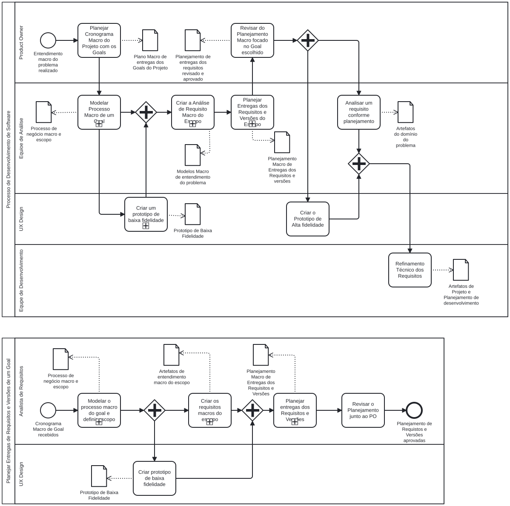

# Refinamento da Analise

[:material-file-download: Baixar em PNG](../process/process.png){ download="process-leds-sdlc.png" }
&nbsp;·&nbsp;
[:material-file-download: Baixar o fonte `process.bpmn`](../process/process.bpmn){ download="process.bpmn" }
&nbsp;·&nbsp;
[Ver a página do diagrama](../process/index.md)

O modelo é composto por dois pools. O primeiro descreve o ciclo completo, do planejamento macro dos *goals* até o refinamento técnico dos requisitos. O segundo detalha o subprocesso de planejamento de entregas de um *goal*.

!!! note "Origem do conteúdo"

    As seções abaixo foram extraídas de `docs/process/process.bpmn`: responsável, tipo de elemento, sequência e artefatos vêm do modelo. As descrições de **como** executar cada atividade ainda precisam ser escritas pela equipe.

---

## Processo de Desenvolvimento de Software

Inicia com o evento **Entendimento macro do problema realizado** e termina no refinamento técnico dos requisitos. Não há evento de fim modelado neste pool.

### 1. Planejar Cronograma Macro do Projeto com os Goals

- **Responsável:** Product Owner
- **Tipo:** Tarefa
- **Recebe de:** evento inicial — entendimento macro do problema realizado
- **Entrega para:** Modelar Processo Macro de um Goal
- **Artefatos produzidos:** Plano Macro de entregas dos Goals do Projeto

Define a sequência e o prazo macro em que os *goals* do projeto serão entregues.

### 2. Modelar Processo Macro de um Goal

- **Responsável:** Equipe de Análise
- **Tipo:** Subprocesso
- **Recebe de:** Planejar Cronograma Macro do Projeto com os Goals
- **Entrega para:** Criar um protótipo de baixa fidelidade e, em paralelo, direto para a junção que antecede a análise de requisitos
- **Artefatos produzidos:** Processo de negócio macro e escopo

Modela o processo de negócio do *goal* selecionado e delimita o escopo correspondente.

### 3. Criar um protótipo de baixa fidelidade

- **Responsável:** UX Design
- **Tipo:** Subprocesso
- **Recebe de:** Modelar Processo Macro de um Goal
- **Entrega para:** junção paralela que antecede a análise de requisitos
- **Artefatos produzidos:** Protótipo de Baixa Fidelidade

Roda em paralelo à continuação da análise. Os dois caminhos precisam chegar à junção antes que a atividade seguinte comece.

### 4. Criar a Análise de Requisito Macro do Escopo

- **Responsável:** Equipe de Análise
- **Tipo:** Subprocesso
- **Recebe de:** junção paralela (modelagem do processo macro e protótipo de baixa fidelidade)
- **Entrega para:** Planejar Entregas dos Requisitos e Versões do Escopo
- **Artefatos produzidos:** Modelos Macro de entendimento do problema

### 5. Planejar Entregas dos Requisitos e Versões do Escopo

- **Responsável:** Equipe de Análise
- **Tipo:** Subprocesso — detalhado no pool [Planejar Entregas de Requisitos e Versões de um Goal](#planejar-entregas-de-requisitos-e-versoes-de-um-goal)
- **Recebe de:** Criar a Análise de Requisito Macro do Escopo
- **Entrega para:** Revisar o Planejamento Macro focado no Goal escolhido
- **Artefatos produzidos:** Planejamento Macro de Entregas dos Requisitos e Versões

### 6. Revisar o Planejamento Macro focado no Goal escolhido

- **Responsável:** Product Owner
- **Tipo:** Tarefa
- **Recebe de:** Planejar Entregas dos Requisitos e Versões do Escopo
- **Entrega para:** divisão paralela que dispara as duas atividades seguintes
- **Artefatos produzidos:** Planejamento de entregas dos requisitos revisado e aprovado

Ponto de aprovação do Product Owner. A partir daqui, análise detalhada e protótipo de alta fidelidade seguem em paralelo.

### 7. Analisar um requisito conforme planejamento

- **Responsável:** Equipe de Análise
- **Tipo:** Tarefa
- **Recebe de:** divisão paralela após a revisão do planejamento
- **Entrega para:** junção paralela que antecede o refinamento técnico
- **Artefatos produzidos:** Artefatos do domínio do problema

### 8. Criar o Protótipo de Alta Fidelidade

- **Responsável:** UX Design
- **Tipo:** Tarefa
- **Recebe de:** divisão paralela após a revisão do planejamento
- **Entrega para:** junção paralela que antecede o refinamento técnico
- **Artefatos produzidos:** nenhum artefato modelado

Roda em paralelo à análise do requisito.

### 9. Refinamento Técnico dos Requisitos

- **Responsável:** Equipe de Desenvolvimento
- **Tipo:** Tarefa
- **Recebe de:** junção paralela (análise do requisito e protótipo de alta fidelidade)
- **Entrega para:** nenhuma atividade seguinte modelada
- **Artefatos produzidos:** Artefatos de Projeto e Planejamento de desenvolvimento

Última atividade do pool. Traduz os requisitos analisados em artefatos de projeto e no planejamento de desenvolvimento.

---

## Planejar Entregas de Requisitos e Versões de um Goal

Detalha o subprocesso da [atividade 5](#5-planejar-entregas-dos-requisitos-e-versoes-do-escopo). Inicia com o evento **Cronograma Macro de Goal recebido** e termina com **Planejamento de Requisitos e Versões aprovado**.

### 1. Modelar o processo macro do goal e definir escopo

- **Responsável:** Analista de Requisitos
- **Tipo:** Subprocesso
- **Recebe de:** evento inicial — cronograma macro do *goal* recebido
- **Entrega para:** divisão paralela que dispara as duas atividades seguintes
- **Artefatos produzidos:** Processo de negócio macro e escopo

### 2. Criar protótipo de baixa fidelidade

- **Responsável:** UX Design
- **Tipo:** Tarefa
- **Recebe de:** divisão paralela após a modelagem do processo macro
- **Entrega para:** junção paralela que antecede o planejamento de entregas
- **Artefatos produzidos:** Protótipo de Baixa Fidelidade

### 3. Criar os requisitos macros do escopo

- **Responsável:** Analista de Requisitos
- **Tipo:** Subprocesso
- **Recebe de:** divisão paralela após a modelagem do processo macro
- **Entrega para:** junção paralela que antecede o planejamento de entregas
- **Artefatos produzidos:** Artefatos de entendimento macro do escopo

Roda em paralelo à criação do protótipo de baixa fidelidade.

### 4. Planejar entregas dos Requisitos e Versões

- **Responsável:** Analista de Requisitos
- **Tipo:** Subprocesso
- **Recebe de:** junção paralela (protótipo de baixa fidelidade e requisitos macros do escopo)
- **Entrega para:** Revisar o Planejamento junto ao PO
- **Artefatos produzidos:** Planejamento Macro de Entregas dos Requisitos e Versões

### 5. Revisar o Planejamento junto ao PO

- **Responsável:** Analista de Requisitos
- **Tipo:** Tarefa
- **Recebe de:** Planejar entregas dos Requisitos e Versões
- **Entrega para:** evento final — planejamento de requisitos e versões aprovado
- **Artefatos produzidos:** nenhum artefato modelado

Fecha o subprocesso com a aprovação do Product Owner.

---

## Artefatos do processo

| Artefato | Produzido em | Responsável |
| --- | --- | --- |
| Plano Macro de entregas dos Goals do Projeto | Planejar Cronograma Macro do Projeto com os Goals | Product Owner |
| Processo de negócio macro e escopo | Modelar Processo Macro de um Goal | Equipe de Análise |
| Protótipo de Baixa Fidelidade | Criar um protótipo de baixa fidelidade | UX Design |
| Modelos Macro de entendimento do problema | Criar a Análise de Requisito Macro do Escopo | Equipe de Análise |
| Planejamento Macro de Entregas dos Requisitos e Versões | Planejar Entregas dos Requisitos e Versões do Escopo | Equipe de Análise |
| Planejamento de entregas dos requisitos revisado e aprovado | Revisar o Planejamento Macro focado no Goal escolhido | Product Owner |
| Artefatos do domínio do problema | Analisar um requisito conforme planejamento | Equipe de Análise |
| Artefatos de Projeto e Planejamento de desenvolvimento | Refinamento Técnico dos Requisitos | Equipe de Desenvolvimento |
| Artefatos de entendimento macro do escopo | Criar os requisitos macros do escopo | Analista de Requisitos |

## Responsáveis

| Raia | Atividades |
| --- | --- |
| Product Owner | Planejar Cronograma Macro do Projeto com os Goals; Revisar o Planejamento Macro focado no Goal escolhido |
| Equipe de Análise | Modelar Processo Macro de um Goal; Criar a Análise de Requisito Macro do Escopo; Planejar Entregas dos Requisitos e Versões do Escopo; Analisar um requisito conforme planejamento |
| UX Design | Criar um protótipo de baixa fidelidade; Criar o Protótipo de Alta Fidelidade |
| Equipe de Desenvolvimento | Refinamento Técnico dos Requisitos |
| Analista de Requisitos | Modelar o processo macro do goal e definir escopo; Criar os requisitos macros do escopo; Planejar entregas dos Requisitos e Versões; Revisar o Planejamento junto ao PO |
